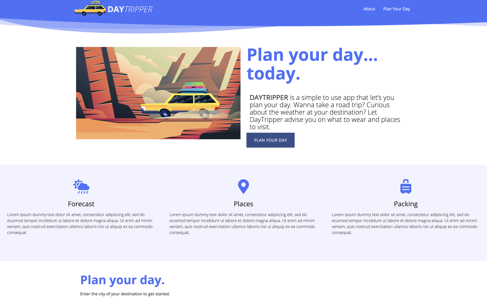

# DayTripper (Project 1 — Brought to you by The Wandering Earls)

DAYTRIPPER is a simple to use app that let’s you plan your day. Wanna take a road trip? Curious about the weather at your destination? Let DayTripper advise you on weather conditions, what to wear and places to visit.

## Important URLs

- [Wireframe](https://w1z9cu.axshare.com)
- [Deployed Application URL](https://candracodes.github.io/daytripper/)
- [GitHub Repo URL](https://github.com/candracodes/daytripper)

## Foreword

- This application aims to accomplish the following:
  - [Adhere to Project 1 Acceptance Criteria](./assets/_guide/README.md)
  - Use a CSS framework other than Bootstrap.
  - Be deployed to GitHub Pages.
  - Be interactive (i.e., accept and respond to user input).
  - Use at least two server-side APIs.
  - Does not use alerts, confirms, or prompts (use modals).
  - Use client-side storage to store persistent data.
  - Be responsive.
  - Have a polished UI.
  - Have a clean repository that meets quality coding standards (file structure, naming conventions, follows best practices for class/id naming conventions, indentation, quality comments, etc.).
  - Have a quality README (with unique name, description, technologies used, screenshot, and link to deployed application).

## User Story

```
As a Traveling enthusiast...
I WANT to search an APP that provides the current weather for a city and gives me a suggestion for what items I should bring...
SO THAT I can efficiently take more trips, and be more prepared...
```

## Acceptance Criteria

```
GIVEN a travel application with a search input
WHEN I search for a city
THEN I am presented with current conditions for that city and that city is added to the search history
WHEN I view current weather conditions for that city
THEN I am presented with the city name, an icon representation of weather conditions, a description of the weather condition, the temperature, and the humidity, 
WHEN I view the Recommendations Link
THEN I am presented with a modal with suggestions for the user 
WHEN I click on a city in the search history
THEN I am again presented with current conditions for that city
```

## Mock-Up

* This project should resemble the following screenshot:



## Frameworks and Libraries

The following frameworks are used in this application

- [API 1: Google Maps](https://developers.google.com/maps)
- [API 2: OpenWeatherMap](https://openweathermap.org/api)
- [CSS Library: Materialize](https://materializecss.com/)
- [FontAwesome — v5.8.1](https://fontawesome.com/v5.15/how-to-use/on-the-web/referencing-icons/basic-use)
- [jQuery — v3.2.1](https://api.jquery.com/)
- [Google Fonts - Open Sans](https://fonts.googleapis.com/css2?family=Open+Sans:ital,wght@0,300;0,400;0,600;0,700;1,300;1,400;1,600;1,700&display=swap)
